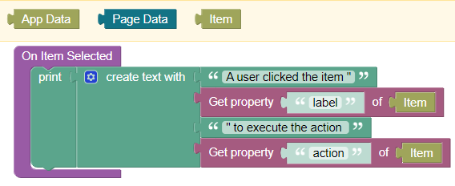

# Endless Context Menu

This is the documentation for the UI component ***Endless Context Menu Pro*** for the [Backendless Full Stack Visual App Development Platform](https://backendless.com).

<center>


</center>

> <b>Disclaimer</b>: No support is provided for the free (non-PRO) version of this component!

<br>

## Use Cases
For desktop web applications, define context menus which appear on right-mouse-click. On one page, multiple menus can be defined by linking one menu to a UI element. Clicking on a menu item triggers an event handlers where you can code the respective actions. Context menus can have a two-level hierarchical structure.

## General usage
Place the component within a Block-UI-component which shall show a context menu on right mouse click.

<br>

## Properties

### Items
A list (array) of menu items. The list contains objects each representing a menu item with its properties. Separator lines are represented by the string ``"hr"``. Items can be defined by directly assigning a JSON object to the ``Items``-property, or by data binding. The default value for the ``Items``-property provides an example of how to use a JSON object:
```json
[{
  "action": "copy",
  "label": "Copy",
  "iconClass": "material-icons-round",
  "iconName": "content_copy"
},
  {
    "action": "paste",
    "label": "Paste",
    "iconClass": "material-icons-round",
    "iconName": "content_paste"
  },
  "hr",
  {
    "action": "submenu",
    "label": "more ...",
    "submenu":
    [{
      "action": "subaction1",
      "label": "Sub-Action 1"
    },
      {
        "action": "subaction2",
        "label": "Sub-Action 2"
      }]
  }]
```
The following elements can be used to define a menu item:
- ``action``: an Id which identifies the action to be performed when clocking on the menu item.
- ``label``: the text which will be shown to the user. If you support multi-lingual applications, ``action`` will identify the action to be performed, while ``label`` will vary according to the actual language.
- ``iconClass``: (optional) the name of the CSS class defining an icon set. Backendless per default includes the icon class ``material-icons-round``.
- ``iconName``: (optional) the name of an icon to be displayed left to the icon label. Names of material icons can be looked-up at https://fonts.google.com/icons?icon.style=Rounded&icon.set=Material+Icons. 
- ``submenu``: (optional) must be followed by another list (array) of menu items. Only one level of submenus are supported (no submenus of submenus).

If you want to define a menu programmatically, then use data binding for the ``Items``-property. As an example, assume the ``Items``-property is bound to the property ``menuItems`` of Page Data. The menu can then, for instance, be defined in the ``On Page Enter`` handler:


### Close On Click
If checked, the menu is closed when clicking on a menu entry (except for opening a submenu).

### Show Up Duration
The duration in milliseconds used for animating the context menu.

<br>

## Actions
None.

<br>

## Events

### On Items Selected
This event is raised, if a user clicks on a menu item. The handler receives the context block ``item`` with the properties ``action`` and ``label``.



<br>

## Reused libraries and components
This product includes the following external code libraries/components, which are not owned by the authors of ***Endless Context Menu Pro***:

- [vanilla-context-menu](https://github.com/GeorgianStan/vanilla-context-menu). Licensed under the [MIT License](https://github.com/GeorgianStan/vanilla-context-menu/blob/master/LICENSE).
