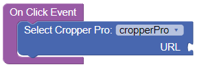
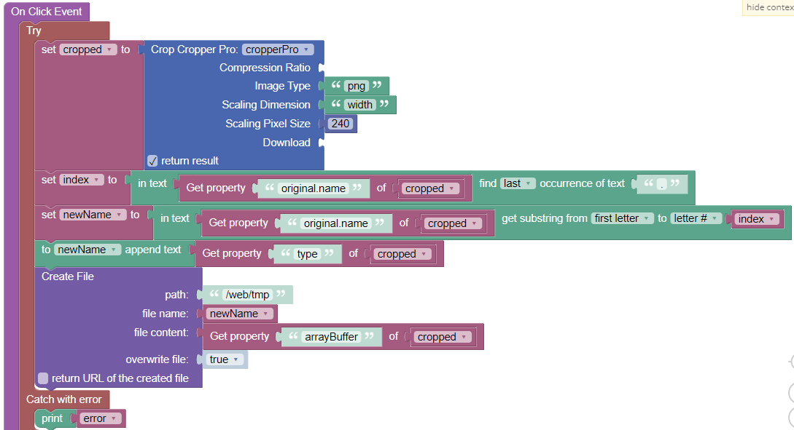
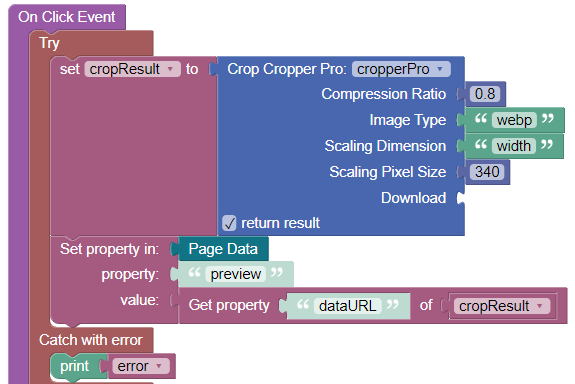

# Endless Cropper

---
>**This component has not been released yet!**
---

This is the documentation for the UI components ***Endless Cropper*** and ***Endless Cropper Pro*** for the [Backendless Full Stack Visual App Development Platform](https://backendless.com).

 &nbsp; &nbsp; &nbsp; &nbsp;

## Use Cases
- Select an image from local file system, or mobile device camera
- Paste an image from clipboard (**Pro-version only**)
- Rotate the image
- Zoom in/out
- Crop a retangular area of interest 
- Crop a circular area (**Pro-version only**)
- Reduce size (width, height) and quality (for lossy image formats) (**Pro-version only**)
- Change image type of original image to jpg, png, webp, etc. (**Pro-version only**)
- Select the cropping result for further processing by Backendless No-Code logic (e.g. saving to the Backendless file system).

All processing is done in the browser client. No transfer of original, large files to the backend just to process them there and to delete them afterwards.

 

## General usage
1. Place a Block-UI-component on a page where you want to display the preview of an image to be uploaded. Adjust the dimensions and other properties of this Block-component to your needs.
2. Place the UI component **Cropper** or **Cropper Pro** into the Block-component. 
3. Fill the ``Id`` property of the custom component in the side panel. Otherwise, you will not be able to work with actions.
4. Place buttons on your page. In the respective "On Click Event"-handlers call one of the component actions. An example how this can look like is shown here:

A resizable crop area is shown after an image has been selected or pasted. Buttons can be defined according to application needs. Buttons can have on-click handlers using the component actions.

 

## Actions
For each Codeless Block of an action, you have to select the ``Id`` of the custom component instance, which you placed on the page.

### Select
*Input parameters:* None

An image selection dialog is shown, which depends on the device. On mobiles, you can typically capture a live camera image, or select an existing image from the device.

*Example*:

### Paste from Clipboard
(**Pro-version only**)

*Input parameters:* None

An image is inserted from the device clipboard into the canvas. If this is done for the first time, the device will ask for permissions for this operation. If you do not grant permission, the paste operation will fail. 

*Example*:

> **Note:** The paste action does not work on all browsers (yet). For instance, Firefox is not supporting the required permission. Therefore, if you want to leverage this action, test with the browser versions relevant to you.

### Crop
Extracts the image from the current cropping area. At the same time, the image can be scaled along its width or height dimension and the image encoding type can be chosen (jpeg, webp, png, etc.). For image types supporting lossy compression (e.g. jpeg, webp) the amount of compression can be specified. **Scaling and changing image types is available in the Pro-version only**:

*Input parameters:*

- ``Compression Ratio``: (**Pro-version only**) Optional. A number between 0 and 1. The default is ``0.8``. Is applied if the resulting image type supports lossy compression (e.g., jpg or webp). For the free version, this ratio is fixed at ``0.8``.
- ``Image Type``: (**Pro-version only**) Optional. The image encoding type ("jpg", "png", etc.) for cropped images. If omitted, the type is taken from the original filename.
- ``Scaling Dimension``: (**Pro-version only**) Optional. Valid values are "width" and "height". The cropped image can be scaled along either its width or height dimension. If neither the parameter ``Scaling Dimension`` nor ``Scaling Pixels`` is specified, the cropped image will not be scaled.
- ``Scaling Pixels``: (**Pro-version only**) Optional. The amount of pixels to be set for the selected scaling dimension. The number of pixels for the other dimension is computed in a way that does not change the image aspect ratio. If neither the parameter ``Scaling Dimension`` nor ``Scaling Pixels`` is specified, the cropped image will not be scaled.
- ``Download``: A boolean value to indicate whether the cropped image shall be downloaded to the device. A device specific download dialog appears then. Depending on browser settings, the download into a standard download folder might even start automatically.

*Return value:*

The cropped image can be further processed by Backendless codeless logic.
An object with the following properties is returned:
- ``width``: the scaled image width
- ``height``: the scaled image height
- ``commpression``: the compression ratio
- ``type``: the type of the cropped image (jpg, png, etc.)
- ``croppedRange``: an object containing ``left``, ``top`` pixel coordinates and ``width``, ``height`` pixel ranges of the cropping area in the **original** image.
- ``original``: an object containing the following properties of the **original** image:
   - ``name``: filename
   - ``mimeType``: the mime type (e.g., ``image/jpeg``)
   - ``size``: in bytes
   - ``width`` and ``height``
- ``arrayBuffer``: the binary cropped image data of type ArrayBuffer
- ``dataURL``: the data URL of the cropped image

*Example*:

This example shows how to crop an image and save it to the Backendless file system.

The cropped image is
- compressed with a ratio of ``0.8`` (default value)
- converted into a ``png``-image
- scaled to 240 pixels along the horizontal direction, whereas the height is set to keep the aspect ratio

Then, some string manipulation is done to construct the new filename, which needs to have the ``png``-extension. Finally, the file is saved to the Backendless file system by using ``arrayBuffer`` image data.

### Rotate

The image is rotated on the canvas.

*Input parameters:* 
- ``Degree``: The amount of rotation degrees. Can be a positive or negative number.

*Example*:

### Zoom In/Out
The image is (de)magnified on the canvas.
> Note: A user can also use a mouse-wheel or touch gestures to zoom in/out.

*Input parameters:* 
- ``Ratio``: The ratio of (de-)magnification . Can be a positive or negative number.

> Note: Zooming-in/out is  just a visual effect. The actual image dimensions
and content is not changed by this operation.

*Example*:

### Reset
The cropper is set back to its initial state. This means zoom factor is set to ``1`` and the crop area is set to its default size.

### Remove Image
A selected image is removed from the cropper canvas.

 

## Properties

### Image Restriction
(**Pro-version only**) Determines how the inital image is displayed in a constrained canvas. The property can take the following values:
- *Fit Area*: The image is scaled to be completely visible within the canvas. If the image aspect ratio does not match the canvas aspect ratio. the canvas will not be filled completely.
- *Fill Area*: The image is scaled to fit at least one dimension of the canvas. You can move and zoom into the image to see other parts, but the cropping area can never extend beyond the canvas.
- *Stencil*: Initially similar to *Fit Area*. In addition you can move the image around and zoom out.
- *None*: No restriction for moving and resizing the image.

For the free version of ***Cropper***, image restriction is always set to *Fit Area*.

### Aspect Ratio
(**Pro-version only**) The property *Aspect Ratio* can take three types of values:
- The empty value is the default value. The initial aspect ratio of the resizable crop area equals the aspect ratio of the loaded image. The aspect ratio can then be changed by a user.
- *\<any number\>*: The aspect ratio of the crop area is set to this number. It is kept constant even if a user is resizing the crop area.
- The value "*image*": The aspect ratio is set to the aspect ratio of the loaded image and cannot be changed by the user.

### Stencil Shape
(**Pro-version only**) You can choose between a *rectangular*, and *circular* cropping area (= *stencil*). By default, a rectangular stencil is shown. An example of a circular stencil is shown here:

In this example, the original image has a width of 1920 pixel, but is displayed with a reduced size due to the dimension of a bounding Block-element (dashed borders). The cropping result is shown in its original size, which has been chosen to have a width of 340 pixel.

The property ``dataURL`` of the object ``cropResult`` is assigned to the ``Page Data`` property ``preview`` which is bound to the "Source URL Logic" of an Image UI-component.

When cropping a circular area, the background of the resulting image is set to white with 100% transparency. To leverage transparency, you have to choose an output image format which supports transparent image parts (``png``, or ``webp``).

> **Note**: You get a real circular and fixed shape only if you choose an *Aspect Ratio* of 1. Otherwise, an oval stencil is created.

 

## Events

### On Image Loaded
(**Pro-version only**)

Each time a new image is selected or pasted, this event handler is invoked. Via the context block ``File`` it provides information about the image and the file which has been selected. ``File`` is an object with the following properties:
- ``name`` of the image file
- ``size`` of the image file in bytes
- ``mimeType`` of the image, e.g., ``image/jpeg``
- ``width`` and ``height`` of the image in pixel

 

### On Paste Error
(**Pro-version only**)

The ``Paste from Clipboard`` action is an asynchronous operation. Therefore, error handling is provided by an event handler. If an error during pasting occurrs, or if there is no image in the clipboard, this event handler is invoked. The passed ``error`` object has properties ``code`` and ``message``. See section [Error handling](#error-handling) below.

 

## Error handling
Whenever you use codeless blocks to call component actions, you should wrap them by a ``try/catch`` block. Actions throw an error object which contains a ``code`` and a ``message`` property.

### Table of error codes and messages

| Code  |  Message                            |
| ----- | ----------------------------------- |
| 101   | An image must be selected or pasted first |
| 102   | Not allowed to read from clipboard |
| 103   | Clipboard contains no image data (1) |
| 104   | Clipboard contains no image data (2) |
| 105   | Dimension parameter must be either "width" or "height" |
| 106   | Compression ratio must be >0 and <=1 |

 

### Error handling for "Paste from Clipboard" action
(**Pro-version only**)

The ``Paste from Clipboard`` action is special because it runs asynchronously. Therefore, errors are communicated via the event ``On Paste Error`` (see above event description).

 

## Support
If you experience issues, you can [open an issue](https://github.com/klako-web/Endless-Components/issues/new) and assign the label ``cropper``, or ``cropperPro``. No support guarantee is provided for the free version!

 

## Reused libraries and components
This product includes the following external code libraries/components:

- [react-advanced-cropper](https://github.com/advanced-cropper/react-advanced-cropper) licensed under the [MIT License](https://github.com/advanced-cropper/react-advanced-cropper/blob/master/LICENSE)