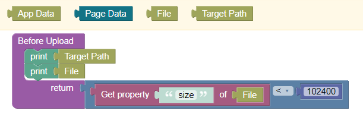
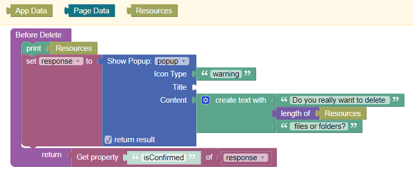
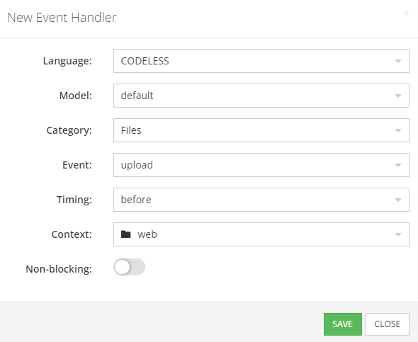
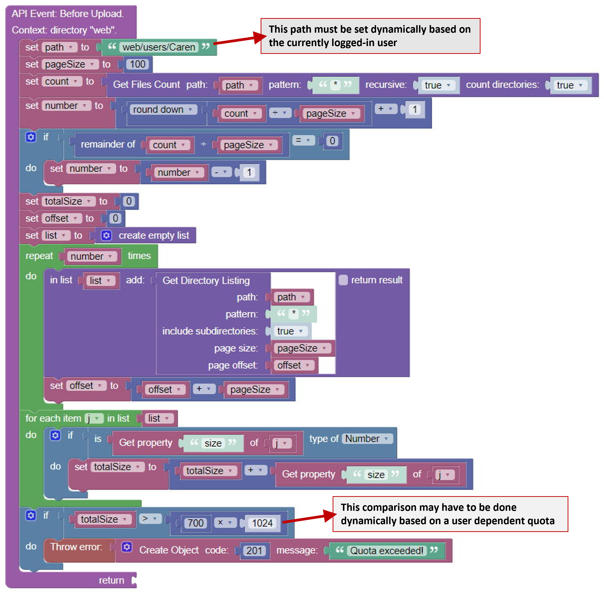

# Endless File Manager

This is the documentation for the UI components ***Endless File Manager*** and ***Endless File Manager Pro*** for the [Backendless Full Stack Visual App Development Platform](https://backendless.com).

<center>

 &nbsp; &nbsp; &nbsp; &nbsp;


</center>

## Use Cases
Upload, download, view and organize files on the Backendless file system.


<br>

>**Disclaimer**: No support will be provided for the free (non-Pro) version of this component!

<br>

## General usage
- Place the component somewhere on a page.  It renders with a width of 100%. To choose a different width, place the component within a UI Builder Block component with an appropriate sizing.
- By default, *File Manager* is in read-only mode. If you specify an accessible ``System Root Path`` and ``User Root Path``, then *File Manager* will display the current content of the resulting folder (see below).

<br>

## File Manager features
*File Manager* is a tool on top of the Backendless file system. It allows you to 
- navigate in the folder hierarchy
- open files in your browser or download them to your device
- upload files (also via drag-and-drop) (pro-version only)
- create new folders (pro-version only)
- rename files and folders (pro version only)
- move/copy/paste files and folders (also via drag-and-drop) (pro-version only)
- delete files and folders (pro-version only)
- share links to files (pro version only)

<br>

## File system paths
*File Manager* provides a "window" to the Backendless file system at a certain file sytem path. When *File Manager* is initialized, it shows the file system content at ``<Root Path>``, which is composed of two components:
```
<Root Path> = <System Root Path> + <Visible Root Path>
```
A user cannot go upwards beyond ``<Root Path>``. So, it should point to a folder which has been created for a user to hold her files and subsequent folders. ``<System Root Path>`` is not visible to users, whereas ``<Visible Root Path>`` is displayed as the root of the navigation hierarchy in *File Manger*. For example, if ``<Visible Root Path> = '/Documents'`` then the initial navigation bar looks like:


Assume you have created the folder ``/web/users`` to contain files of your app users. Each user might get its own folder created upfront. So all files of user "Caren" will be within ``/web/users/Caren``. Assume you want offer *File Manager* to Caren to upload own files into the subfolder ``Documents``. In this case you might choose ``<System Root Path> = '/web/users/Caren'`` and ``<Visible Root Path> = '/Documents'``. Make sure that the subfolder ``Documents`` already exists before *File Manager* gets initialized. Note, that the default value of ``<Visible Root Path>`` is ``'/'``. To choose ``<System Root Path>`` dynamically depending on the logged-in user, user data binding for the UI component property ``System Root Path``.

<br>

## Actions
None.

<br>

## Properties

### Read Only
(**Pro-version only**): The free version of *File Manager* is always operating in read-only mode. For the Pro-version, you can unselect this property checkbox to allow upload, create, move, copy, paste and delete operations.

### System Root Path
See section [File System Paths](#file-system-paths). You can use data binding to set this property in a user dependent way.

### Visible Root Path
See section [File System Paths](#file-system-paths). You can use data binding to set this property in a user dependent way.

<br>

## Event Handlers

### Error Handler
All errors which occur during *File Manager* operations are communicated via this event handler.


During a *File Manager* operation, multiple errors might occur. For instance, when trying to delete a set of files at once. Therefore, ``Error`` is of type "list of objects" to capture mutiple errors of one operation. One error object has a structure as in the following example:
```
{
    code: 4000,
    message: "User has no permissions for specified resource",
    resource: "web/users/Caren/Documents/Misc/Letter.pdf"
}
```
Standard Backendless error codes are used as listed in the [Backendless Files API documentation](https://backendless.com/docs/js/files_overview.html). In addition, *File Manager* defines the following errors:

| Code  |  Message                            |
| ----- | ----------------------------------- |
| 102   | No permission to upload files |
| 104   | No permission to create folders |
| 105   | No permission for renaming operation |
| 106   | No permission for delete operation |
| 107   | No permission for copy operation |
| 108   | No permission for move operation |
| 201   | Quota exceeded |

### Before Upload
(**Pro-version only**) 
Before a file upload operation is started, you can introduce criteria to prevent/allow this operation by implementing this handler. The operation is performed if the handler returns ``true`` and is canceled otherwise. The following example restricts the size of a single file to 100 kB.



If multiple files are uploaded at once, the handler is called for each file.

### Before Delete
(**Pro-version only**) 
This handler is called once before one or muliple files/folders shall be deleted. Deletion is performed if the handler returns ``true`` and canceled otherwise.

A sample implementation using the custom UI component ``Endless Popup`` could look like this:



The context block ``Resources`` provides a list of objects representing the to be deleted objects. A sample content is shown here:
```
[ 
  {name: 'Tax', type: 'folder', uri: 'web/users/Carin/Documents/Tax'},
  {name: 'Important.docx', type: 'file', uri: 'web/users/Carin/Documents/Important.docx'}, 
  {name: 'Letter.pdf', type: 'file', uri: 'web/users/Carin/Documents/Letter.pdf'}
]
```

### Before Open File
(**Pro-version only**) 
This handler is called before an action is performed in response to a double-click on a file icon. The context block ``File`` contains attributes of the file to be opened. Sample content:
```
{
  name: "profileImage.jpg",
  path: "web/users/Caren/profileImage.jpg",
  size: 4096,
  url: "https://backendlessappcontent.com/6E10590/89CD/files/web/users/Caren/profileImage.jpg",
  createdOn: 1665673676313,
  updatedOn: 1665673676499
}
```
The handler has a return parameter.
- If nothing is returned (or if the handler is not implement at all), the system launches the command ``window.open(url)``. The resulting action depends on the browser settings. For instance, browsers contain image viewers which can display images a new browser tab or window. Files with file types unknown to the browser will be downloaded to the browser's download folder.
- If ``false`` is returned, the system will perform no action to open the file. This is useful if you want to implement your own "open file" action.
- All other return values are interpreted as a changed URL used to launch  the ``window.open()`` command. This is useful, for instance, if you want to replace the domain name in ``Files.url`` to match the domain where your app is hosted.

### Before Share
(**Pro-version only**) 
This handler is called before the share operation for a selected file is executed. The context block ``File`` contains attributes of the file to be opened. Sample content:
```
{
  name: "profileImage.jpg",
  path: "web/users/Caren/profileImage.jpg",
  size: 4096,
  url: "https://backendlessappcontent.com/6E10590/89CD/files/web/users/Caren/profileImage.jpg",
  createdOn: 1665673676313,
  updatedOn: 1665673676499
}
```
The handler has a return parameter.
- If nothing is returned (or if the handler is not implement at all), the system launches the command for sharing data. Depending on the device, a dialog is shown which lets you choose how to share the link of the selected file. If your device does not support a standard share dialog, then the link is copied to the clipboard.
- If ``false`` is returned, the system will perform no action to share the link. This is useful if you want to implement your own "share link" action.
- All other return values are interpreted as a changed URL to be passed to the share command. This is useful, for instance, if you want to replace the domain name in ``Files.url`` to match the domain where your app is hosted.

<br>

## Error handling
See section [Error Handler](#error-handler).

<br>

## Protecting files

> **NOTE**: **The only secure way to protect files against unwanted access or operations is the Backendless permission system for files. *File Manager* and *File Manager Pro* cannot provide any secure mechanism to protect files against unwanted access.**

*File Manager* and *File Manafr Pro* are tools which run in your Browser client. An experienced programmer can inspect all code in the browser and might change it. Therefore, as any other client side tool, *File Manager* and *File Manager Pro* cannot provide secure mechanisms for protecting files against unwanted access.

The Backendless platform provides means to grant permissions to restrict file access and file operations. You should consult the documentation on [Backendless Files Security](https://backendless.com/docs/rest/files_files_security.html). 

<br>

## Implementing quotas
With such a flexible and easy to use tool like this file manager, your users can easily upload files to the  Backendless file system. As the costs of storing data is on your side, you will probably want to introduce quotas for your users, to prevent them from occupying too much file system space. For the same reasons as discussed in section [Protecting files](#protecting-files), *File Manager* and *File Manager Pro*, as client side tools, cannot implement quotas in a reliable way. Such a mechanism must be implemented as a server side logic, which users cannot modify. The Backendless platform provides the means of backend ``Event Handlers`` to solve this requirement. Specifically, you can implement a ``Before Upload`` handler from the "Files" category on the Backendless backend:



In CODELESS logic, handler implementation could look like this:



If you want to implement a user dependent quota, you have to modify the code at the two indicated locations.

At time of writing this documentation, within the event handler, there is no access to the size of the file to be uploaded. Therefore, the total size computation yields the total size of already uploaded files only. You can follow [this support topic](https://support.backendless.com/t/before-upload-file-attributes/15479) to get notified, once this information is available in the event handler.

A client side solution how to limit the upload size of an individual file has been depicted in section [Before Upload](#before-upload).

<br>

## Reused libraries and components
This product includes the following external code libraries/components, which are not owned by the authors of ***Endless File Manager*** and ***Endless Filemanger Pro***:

- [js-fileexplorer](https://github.com/cubiclesoft/js-fileexplorer). Licensed under the MIT License.