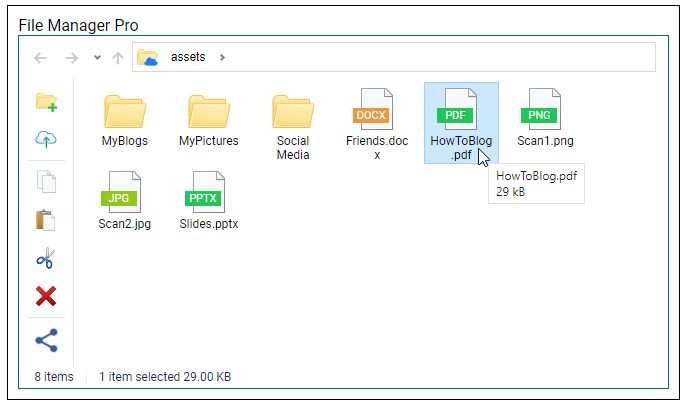
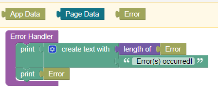

# Endless File Manager

This is the documentation for the UI components ``File Manager`` and ``File Manager Pro`` for the [Backendless Full Stack Visual App Development Platform](https://backendless.com).

<center>

 &nbsp; &nbsp; &nbsp; &nbsp;


</center>

## Use Cases
Upload, view and organize files on the Backendless file system.

>**Disclaimer**: No support will be provided for the free (non-Pro) version of this component!

## General usage
- Place the component somewhere on a page.  It renders with a width of 100%. To choose a different width, place the component within a UI Builder Block component with an appropriate sizing.
- By default, File Manager is in read-only mode. If you specify an accessible ``System Root Path`` and ``User Root Path``, then File Manager will display the current content of the resulting folder (see below).



<br>

## File Manager features
File Manager is a tool on top of the Backendless file system. It allows you to 
- navigate in the folder hierarchy
- open files in your browser or download them to your device
- upload files (also via drag-and-drop) (pro-version only)
- create new folders (pro-version only)
- rename files and folders (pro version only)
- move/copy/paste files and folders (also via drag-and-drop) (pro-version only)
- delete files and folders (pro-version only)

<br>

## File system paths
File Manager provides a "window" to the Backendless file system content at a certain path in the file system. When File Mangager is initialized, it shows the file system content at the ``Root Path`` which is composed of two components:
```
Root Path = System Root Path + Visible Root Path
```
A user cannot go upwards beyond the ``Root Path``. So, ``Root Path`` should point to a folder which has been created for a user to hold her files and subsequent folders. ``System Root Path`` is not visible to users, whereas ``Visible Root Path`` is displayed as the root of the navigation hierarchy in File Manger.


``Root Path`` must be a valid path in the Backendless file system hierarchy. Assume you have created the folder ``/web/users/`` to contain files of your app users. Each user might get her own folder created. So all files of user "Caren" will be within ``/web/users/Caren``. Assume you want offer the File Manager to Caren to upload own files into the subfolder ``Documents``. In this case you might choose ``System Root Path = /web/users/Caren`` and ``Visible Root Path = /Documents``. Make sure that the subfolder ``Documents`` already exists before File Manager gets initialized. Note, that the default value of ``Visible Root Path`` is ``/``.

<br>

## Actions
None.

<br>

## Properties

### Read Only
(**Pro-version only**): The free version of File Manager is always operating in read-only mode. For the Pro-version, you can unselect this property checkbox to allow upload, create, move, copy, paste and delete operations.

### System Root Path
See section [File System Paths](#file-system-paths). You can use data binding to set this property in a user dependent way.

### Visible Root Path
See section [File System Paths](#file-system-paths). You can use data binding to set this property in a user dependent way.

<br>

## Event Handlers

### Error Handler
All errors which occur during File Manager operations are communicated via this event handler.



During a File Manager  operation, multiple errors might occur. For instance, when trying to delete a set of files at once. Therefore, ``Error`` is of type "list of objects" to capture mutiple errors of one operation. One error object has a structure as in the following example:
```json
{
    code: 4000,
    message: "User has no permissions for specified resource",
    resource: "web/users/Caren/Documents/Misc/Letter.pdf"
}
```
Standard Backendless error codes are used as listed in the [Backendless Files API documentation](https://backendless.com/docs/js/files_overview.html). In addition, File Manager defines the following errors:

| Code  |  Message                            |
| ----- | ----------------------------------- |
| 102   | No permission to upload files |
| 104   | No permission to create folders |
| 105   | No permission for renaming operation |
| 106   | No permission for delete operation |
| 107   | No permission for copy operation |
| 108   | No permission for move operation |
| 201   | Quota exceeded |

### Before Upload
(**Pro-version only**) 

### Before Delete
(**Pro-version only**) 

<br>

## Error handling
See section [Error Handler](#error-handler).

<br>

## Protecting files

> **NOTE**: The only secure way to protect files against unwanted access or operations is the Backendless permission system for files. File Manager cannot provide any secure mechanism to protect files against unwanted access.

File Manager is a tools which runs in your Browser client. Therefore, an experienced programmer can inspect all code in the browser and might change it. Therefore, as any other client side tool, File Manager cannot provide secure mechanisms for protecting files against unwanted access.

The Backendless platform provides means to grant permissions to restrict file access and file operations. You should consult the documentation on [Backendless Files Security](https://backendless.com/docs/rest/files_files_security.html). 

<br>

## Reused libraries and components
This product includes the following external code libraries/components, which are not owned by the authors of ``Endless File Manager`` and ``Endless Filemanger Pro``:

- [js-fileexplorer](https://github.com/cubiclesoft/js-fileexplorer). Licensed under the MIT License.