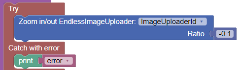
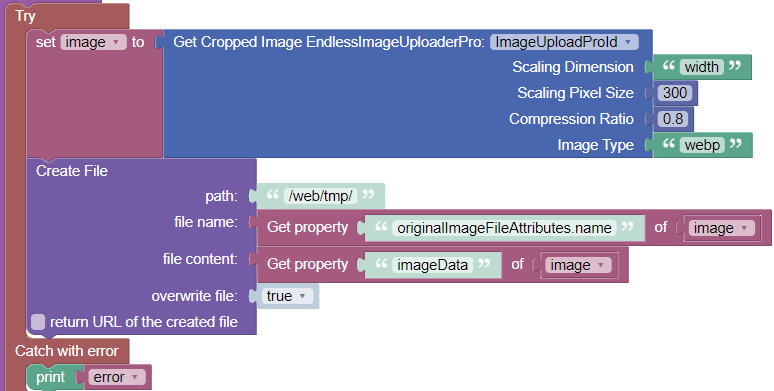
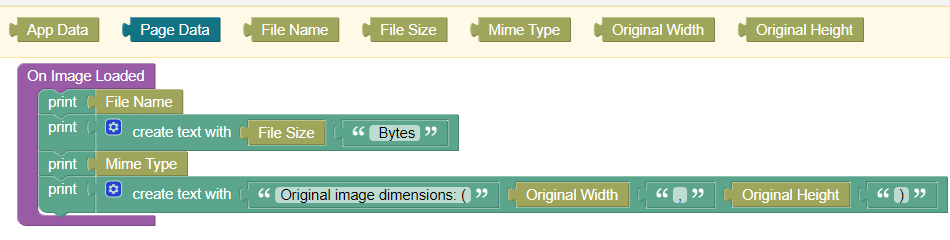
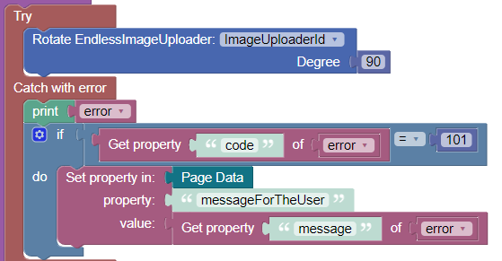

# EndlessImageUploader

This is the documentation for ``EndlessImageUploader`` and ``EndlessImageUploaderPro``.

 &nbsp; &nbsp; &nbsp; &nbsp;

## Use Cases
- Select an image from local file system, or mobile device camera
- Paste an image from clipboard (**Pro-version only**)
- Rotate the image
- Zoom in/out
- Crop an area of interest
- Save the image to Backendless file system. 
- Reduce size (width, height) and quality (for lossy image formats (**Pro-version only**)
- Change image type of original image to jpg, png, webp, etc. (**Pro-version only**)
- Select the cropping result for further processing by Backendless nocode logic (**Pro-version only**).

 

> ---
>**Disclaimer**: This component is not released for productive use yet. No warranties! If you receive a copy of component code from the component author, you are allowed to leverage it for evaluation purposes only. It is not allowed to distribute this code. 
> ---

 

## General usage
1. Place a Block-UI-component on a page where you want to display the preview of an image to be uploaded. Adjust the dimensions and other properties of this Block-component to your needs.
2. Place the custom component ``EndlessImageUploader`` or ``EndlessImageUploaderPro`` into the Block-component. 
3. Fill the ``Id`` property of the custom component in the side panel. Otherwise, you will not be able to work with actions.
4. Place buttons on your page. In the respective "On Click Event"-handlers call one of the custom component actions. An example how this can look like is shown here:

By default, a resizable crop box is shown after an image has been selected or pasted.

 

## Properties

### Display
(**Pro-version only**) Boolean. If unchecked, no image preview is shown. Therefore, a user cannot change the cropping area. In conjunction with the event handler for ``On Image Loaded``, an image can be selected, scaled and uploaded without preview and without the need for a user-triggered save action. An event handler implementing this use case is shown here:

Unchecking the ``Display`` property makes sense only when checking ``No Crop Box`` at the same time. Otherwise, only a part of the image (the crop area) will be saved.

### No Crop Box
(**Pro-version only**) Boolean. If checked, no resizable crop area is shown above the image. Still, parts of the image can be cropped, by zooming-in and moving the image along the canvas. The save and crop action will then crop the visible part of the image.

### Min Canvas Width
(**Pro-version only**) By default, the canvas size is set to the size of loaded image, of course within the constraints set by the surrounding Block-UI-component. If you deal with very small image, it can make sense to set a minimal canvas size in pixel. It is recommended to then either set ``Min Canvas Width`` or ``Min Canvas Height``. The property which is not set will be computed to conserve the image width-to-height ratio.

### Max Canvas Height
(**Pro-version only**) See ``Min Canvas Width``.

 

## Actions
For each Codeless Block of an action, you have to select the ``Id`` of the custom component instance, which you placed on the page.

### Select
*Input parameters:* None

An image selection dialog is shown, which depends on the device. On mobiles, you can typically capture a live camera image in addition to selecting an existing image from the device.

*Example*:

 

### Paste from Clipboard
(**Pro-version only**)

*Input parameters:* None

An image is inserted from the device clipboard into the canvas. If this is done for the first time, the device will ask for permissions for this operation. If you do not grant permission, the paste operation will fail. 

*Example*:

> **Note:** The paste action does not work on all browsers (yet). For instance, Firefox is not supporting the required permission. Therefore, if you want to leverage this action, test with the browser versions relevant for you.

 

### Rotate
The image is rotated on the canvas.

*Input parameters:* 
- ``Degree``: The amount of rotation degrees. Can be a positive or negative number.

*Example*:

 

### Zoom In/Out
The image is (de)magnified on the canvas.
> Note: A user can also use a mouse-wheel or touch gestures to zoom in/out.

*Input parameters:* 
- ``Ratio``: The ratio of (de-)magnification . Can be a positive or negative number.

> Note: Zooming-in/out is  just a visual effect. The actual image dimensions
and content is not changed by this operation.

*Example*:

 

### Save Cropped Image
Uploads the cropped area of the image to the Backendless file system. 

An image can be scaled along its width or height dimension and the image encoding type can be chosen (jpeg, webp, png, etc.). For image types supporting lossy compression (e.g. jpeg, webp) the amount of compression can be specified. **Scaling, changing image types and choosing a compression ratio is available in the Pro-version only**: 

*Input parameters:*
- ``File Name``: Optional. The name of the file to be saved (including file extension). If omitted, the name of the selected file is used, where the file extension is set according to the input parameter ``Image Type``. If an image is pasted from the clipboard and ``File Name`` is omitted, a name "fromClipboard``wxyz``.png" is generated, where ``wxyz`` is a random 4-digit number.
- ``File Path``: Mandatory. The target path on the Backendless file system, for example "/web/tmp/". The current user must have the appropriate permissions to create and write files.
- ``Overwrite``: Optional. Default value is ``false``. Indicates that an existing file with the same name shall be overwritten (``Overwrite = true``), or whether an error shall be raised..
- ``Scaling Dimension``: (**Pro-version only**) Optional. Valid values are "width" and "height". Before uploading the image to the Backendless file system, it can be scaled along either its width or height dimension. If neither the parameter ``Scaling Dimension`` nor ``Scaling Pixels`` is specified, the extracted or saved image will not be scaled.
- ``Scaling Pixels``: (**Pro-version only**) Optional. The amount of pixels to be set for the selected scaling dimension. The number of pixels for the other dimension is computed in a way that does not change the image aspect ratio. If neither the parameter ``Scaling Dimension`` nor ``Scaling Pixels`` is specified, the extracted or saved image will not be scaled.
- ``Compression Ratio``: (**Pro-version only**) Optional. A number between 0 and 1. The default is 0.8 (also for the non-Pro-version). Is applied if the resulting image type supports lossy compression (e.g., jpg or webp).
- ``Image Type``: (**Pro-version only**) Optional. The image encoding type ("jpg", "png", etc.) of images extracted from the canvas. If omitted, the type is taken from the specified filename.

*Return value:*
- The URL of the saved image.

*Example*:

 

### Get Cropped Image
(**Pro-version only**)

Extracts the image from the current cropping area. The image can be further processed by Backendless codeless logic.

*Input parameters:*
The input parameters are the same as for the action ``Save Cropped Image``. Just the file-related parameters are missing.

*Return value:*
An object with the following properties is returned:
- ``width``: the scaled image width
- ``height``: the scaled image height
- ``commpression``: the compression ratio
- ``mimeType``: the mime type of the extracted image
- ``imageData``: the binary image data of type ArrayBuffer
- ``originalImageFileAttributes``: an object composed of:
   - ``name``: the original file name
   - ``size``: the original file size
   - ``type``: the original mime type

*Example*:
This example shows how to crop an image and save it to the Backendless file system.

 

### Reset
The canvas area is set back to its initial empty state.

 

## Events

### On Image Loaded
(**Pro-version only**)

Each time a new image is selected or pasted, this event handler is invoked. It provides information about the image and the file which has been selected.

 

### On Paste Error
(**Pro-version only**)

The ``Paste from Clipboard`` action is an asynchronous operation. Therefore, error handling is provided by an event handler. If an error during pasting occurrs, or if there is no image in the clipboard, this event handler is invoked. The passed ``error`` object has properties ``code`` and ``message``. See section "Error handling" below.

 

## Error handling
Whenever you use codeless blocks to call component actions, you should wrap them by a ``try/catch`` block. Actions throw an error object which contains a ``code`` and a ``message`` property.

 

### Error handling for "Paste from Clipboard" action
(**Pro-version only**)

The ``Paste from Clipboard`` action is special because it runs asynchronously. Therefore, errors are communicated via the event ``On Paste Error`` (see above event description).

 

### Table of error codes and messages

| Code  |  Message                            |
| ----- | ----------------------------------- |
| 101   | An image must be selected or pasted first |
| 102   | Not allowed to read from clipboard |
| 103   | Clipboard contains no image data (1) |
| 104   | Clipboard contains no image data (2) |
| 105   | Dimension parameter must be either "width" or "height" |
| 106   | Compression ratio must be >0 and <=1 |
| 107   | A path parameter must be specified  |
| 108   | Filename must include a file extension  |
| 109   | Extracted image type must match desired filename extension |
| 110   | Clipboard contains no image data (3) |

 

## Restrictions
- It is not possible to place two instances of this component on one page.

 

## Reused libraries and components
This product includes the following external code libraries/components, which are not owned by the author of ``EndlessImageUploader`` and ``EndlessImageUploaderPro``:

- [Cropper.js](https://fengyuanchen.github.io/cropperjs/): Licensed under the [MIT License](https://github.com/fengyuanchen/cropperjs/blob/main/LICENSE)