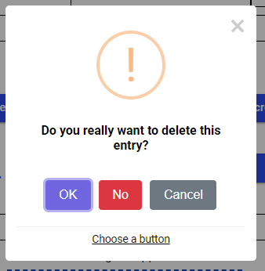
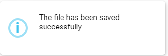
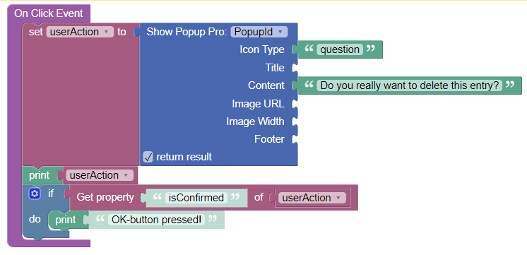
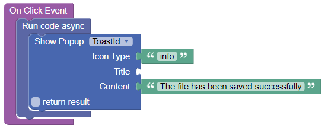

# Endless Popups

This is the documentation for the UI components ***Endless Popup*** and ***Endless Popup Pro*** for the [Backendless Full Stack Visual App Development Platform](https://backendless.com).

<center>

 &nbsp; &nbsp; &nbsp; &nbsp;


</center>

## Use Cases
Create popups, toasts and alerts. Toasts are lightweight notifications windows which are displayed for a certain amount of time.

 &nbsp; &nbsp;&nbsp;&nbsp;



>**Disclaimer**: No support will be provided for the free (non-PRO) version of this component!

## General usage
- Place the component somewhere on a page. There will be no immediate visible reflection in the published preview. Don't worry.
- Fill the ``Id`` property in the side panel. Otherwise, you will not be able to work with actions
- To trigger a popup, use the component action ``Show``. For instance, you can call this action within an ``On Click Event`` of a button.

- This action returns an object which indicates which button has been pressed, for instance ``{"isConfirmed":true,"isDenied":false,"isDismissed":false,"value":true}``

<br>

## Actions
For each Codeless Block of an action, you have to select the ``Id`` of the custom component instance, which you placed on the page.

### Show
This action is exposed via a Backendless Codeless Block. See **General usage** for an example. The block parameter has to be set to the ``Id`` of a component instance on a specific page.

#### Inputs:
- *Icon Type*: The type of the icon show with the popup. Possible values:  ``info``, ``warning``, ``error``, ``success``, ``question``. If no value is specified, no icon is shown.
- *Title*: An optional popup title string. For the **Pro-version**, the string can contain HTML-markup.
- *Content*: The actual message text for the popup. For the **Pro-version**, the text can contain HTML-markup.
- *Image URL*: (**Pro-version only**) A fully qualified URL (https://...) to an image file to be displayed in the popup.
- *Image Width*: (**Pro-version only**) Custom image width. Can have any CSS units (e.g., ``px``, ``em``, ``rem``, ``%``).
- *Footer*: (**Pro-version only**) The text to be shown as popup footer. Can include HTML-markup.

<br>

## Properties

### Show Confirm Button
Boolean to decide whether to show the confirm button. Defaults to ``true``.

### Confirm Button Text
Defaults to "OK".

### Show Deny Button
Defaults to ``false``

### Deny Button Text

### Show Cancel Button
Defaults to ``false``

### Cancel Button Text

### Show Close Button
Defaults to ``false``

### Show as Toast
Defaults to ``false``. A "Toast" is a little message box which shows information for a limited amount of time. Use the ``Duration``-property to control how long the toast is shown. For the **free version**, this interval is fixed at 2500 ms for toasts. It is recommended to run the toast as an asynchronous operation:



### Duration
(**Pro-version only**) Controls how long a popup or toast is shown in milliseconds. For the **free version**, this interval is fixed at 2000 ms.

### Position
(**Pro-version only**) Postion of the popup on the screen. Can be ``Top``, ``Top Left``, ``Top Right``, ``Center``, ``Center Left``, ``Center Right``, ``Bottom``, ``Bottom Left``, ``Bottom Right``. For the **free version**, the position is always ``Center``.

### Width
Popup window width, including paddings (box-sizing: border-box). Can be in any CSS unit (e.g, ``px``, ``em``, ``rem``, ``%``). Defaults to ``32em``.

### Color
Text color for title, content and footer.

### Background
Popup window background color.

### Allow Outside Click
(**Pro-version only**) Defaults to ``true``. If this is set, the popup can be closed by clicking into the background outside of the popup. For the **free version**, the value is always ``true``.

### Show Class
(**Pro-version only**) A CSS-animation class which is used for popup or toast appearance. See section [Animations](#Animations).

### Hide Class
(**Pro-version only**) A CSS-animation class which is used for popup or toast disappearance. See section [Animations](#Animations).

## Styles
(**Pro-version only**) Create a theme extension and change any of the following less-variables:
```less
@el-popup-title-color: inherit; 
@el-popup-title-maxWidth: 100%;
@el-popup-title-margin: 0;
@el-popup-title-padding: 0.3em 1em 0.3em;
@el-popup-title-fontSize: 1.6em;
@el-popup-title-fontWeight: 600;
@el-popup-title-fontStyle: normal;
@el-popup-title-textAlign: center;
@el-popup-title-wordWrap: break-word;
@el-popup-title-backgroundColor: inherit;
 
@el-popup-icon-width:  5em;
@el-popup-icon-height: 5em;
@el-popup-icon-margin: 2em auto 0.6em;

@el-popup-iconWarning-backgroundColor:  inherit;
@el-popup-iconInfo-backgroundColor:     inherit;
@el-popup-iconError-backgroundColor:    inherit;
@el-popup-iconSuccess-backgroundColor:  inherit;

@el-popup-image-margin: 2em auto 1em;

@el-popup-content-textAlign: center; 
@el-popup-content-fontSize: 1em; 
@el-popup-content-fontWeight: 400; 
@el-popup-content-fontStyle: normal; 
@el-popup-content-margin: 1em 1.6em 0.3em;
@el-popup-content-padding: 0.3em 0.1em 0.3em;
@el-popup-content-color: inherit;
@el-popup-content-backgroundColor:  inherit;

@el-popup-actions-margin: 1.25em auto 0;
@el-popup-actions-padding: 0 0 0 0;

@el-popup-actionConfirm-borderStyle: initial;
@el-popup-actionConfirm-borderColor: initial;
@el-popup-actionConfirm-borderWidth: 0px;
@el-popup-actionConfirm-color: #fff;
@el-popup-actionConfirm-backgroundColor: #7066e0;

@el-popup-actionDeny-borderStyle: initial;
@el-popup-actionDeny-borderColor: initial;
@el-popup-actionDeny-borderWidth: 0px;
@el-popup-actionDeny-color: #fff;
@el-popup-actionDeny-backgroundColor: #dc3741;

@el-popup-actionCancel-borderStyle: initial;
@el-popup-actionCancel-borderColor: initial;
@el-popup-actionCancel-borderWidth: 0px;
@el-popup-actionCancel-color: #fff;
@el-popup-actionCancel-backgroundColor: #6e7881;

@el-popup-actionClose-color: #ccc;
@el-popup-actionClose-fontSize: 2.5em;
@el-popup-actionClose-margin: 0 0 -1.4em;

@el-popup-footer-fontSize: 0.85em;
@el-popup-footer-fontWeight: initial; 
@el-popup-footer-fontStyle: normal;
@el-popup-footer-color: inherit;
@el-popup-footer-backgroundColor: inherit;
@el-popup-footer-padding: 0.5em 0.5em 0em;
@el-popup-footer-margin: 1.2em 1em 0em;
@el-popup-footer-justifyContent: center;
@el-popup-footer-borderTop: 1px solid #eee;
```

<br>

## Animations
(**Pro-version only**)
By using the properties ``Show Class`` and ``Hide Class``, CSS-classes can be configured which control the animation behavior when showing and hiding a popup or toast. Animation classes can be defined in the Theme-Editor of Backendless UI-Builder.

<br>

## Reused libraries and components
This product includes the following external code libraries/components, which are not owned by the author of ***Endless Popup*** and ***Endless Popup Pro***:

- [Sweetalert2](https://sweetalert2.github.io/). Licensed under the [MIT License](https://github.com/sweetalert2/sweetalert2/blob/main/LICENSE).