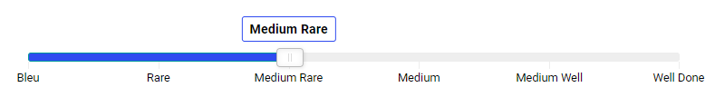

# Endless Range Slider

This is the documentation for the UI component ***Endless Range Slider*** for the [Backendless Full Stack Visual App Development Platform](https://backendless.com).

<center>


</center>

## Use Cases
Select one value or a range of values with a slider.




<br>

## General usage
Place the component on a page. It is recommended to wrap it by a block component to be able to adjust width, padding and margins.

<br>

## Properties

### Range Selector
If this checkbox is checked, the slider is acting as a range selector. Two handles are shown which can be used to select a range.

### Show Selected
Currently selected values/labels are displayed above the slider handles.

### Show Tick Marks
If this checkbox is checked, tick marks are shown below the slider.

### Tick Labels
Tick labels can be defined in two ways:
1. Via a JSON array. Examples:
   ```
   ["low", "medium-low", "medium", "medium-high", "high"]
   ```
   ```
   [-40, -30, -20, -10, 0, 10, 20, 30, 40]
   ```

2. Via a range/step JSON object for numerical labels. Example:
   ```
   {"min": 50, "max": 150, "step": 10}
   ```

### Show Labels
The labels set with ``Tick Labels`` are displayed below the slider.

### Initial Selection
The initial value of the first and, if ``Range Selector=true``, the second selection handle. The values have to be passed as a JSON array (e.g. ``["medium"]``, or ``[60, 90]`` ).

<br>

## Actions

### Set Enabled Status
Pass ``true`` or ``false`` to this action to enable or disable the slider. Example:


### Get Selected Values
Reads the currently selected values/labels from the slider. This action returns a list (array) with one or two values depending on the type of slider (single value selection, or value range selection). Example:


### Set Selection Values
Pass one or two parameters to this action to set the current selection of the slider. In the following example, only one value is passed, because the slider is configured to have one handle only.


<br>

## Events

### On Change

This event handler is called whenever the selection on a slider is changed:


The context block ``Values`` is a list (array) of one or two string values.

<br>

## Styles
Create a theme extension and change any of the following less-variables (default settings as indicated):

```less
@el-range-slider-fontFamily: Roboto, sans-serif;
@el-range-slider-fontSize: 0.8em;
@el-range-slider-fontColor: @appTextColor;
@el-range-slider-fontWeight: normal;

@el-range-slider-bar-color: #eee;
@el-range-slider-bar-selected-color: @buttonContainedBackground;
@el-range-slider-bar-disabled-color: @disabledColor;
@el-range-slider-bar-height: 10px;  

@el-range-slider-pointer-color: #fff;
@el-range-slider-pointer-width: 1.9em;   
@el-range-slider-pointer-height: 1.3em;  
@el-range-slider-pointer-borderRadius: 4px; 
@el-range-slider-pointer-marginTop: 0;

@el-range-slider-scale-marginTop: 10px;  

@el-range-slider-tooltip-fontSize: 0.9em;
@el-range-slider-tooltip-fontColor: @appTextColor;
@el-range-slider-tooltip-fontWeight: bold;
@el-range-slider-tooltip-fontStyle: normal;
@el-range-slider-tooltip-background: @appBackgroundColor;
@el-range-slider-tooltip-border: 1px solid @el-range-slider-bar-selected-color; 
@el-range-slider-tooltip-minWidth: 3.5em;
@el-range-slider-tooltip-width: max-content;
@el-range-slider-tooltip-height: auto;
```

<br>

## Support
No support guarantee is provided for this free version! You can [open an issue](https://github.com/klako-web/Endless-Components/issues/new) though and assign the label ``rangeSlider``.

## Reused libraries and components
This product includes the following external code libraries/components, which are not owned by the authors of ***Endless Range Slider Pro***:

- [range-slider](https://github.com/slawomir-zaziablo/range-slider). Licensed under the [MIT License](https://github.com/slawomir-zaziablo/range-slider/blob/master/LICENSE).
