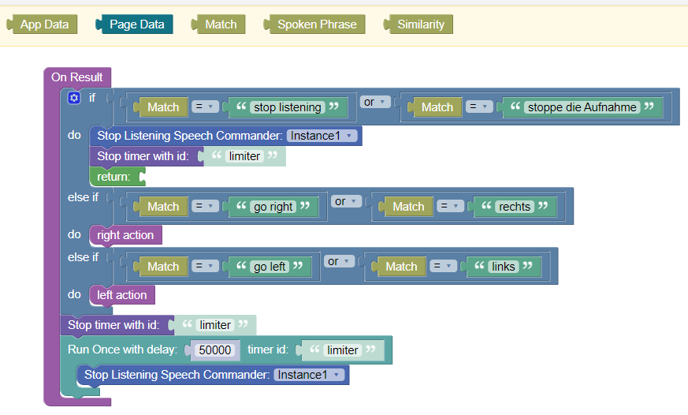

# Endless Speech Commander

This is the documentation for the UI component ***Endless Speech Commander*** for the [Backendless Full Stack Visual App Development Platform](https://backendless.com).

<center>


</center>

---
>**This component has not been released yet!**
---

## Use Case
Developers can create apps with which users can issue commands verbally via the device microphone.

## Technical Setup and Restrictions
>>**Please read this carefully!**

+ ***Speech Commander*** is connecting to a remote service provider which is providing the actual service of speech-to-text recognition. Therefore, ***Speech Commander*** requires an active internet connection. It will not work offline. Due to the remote communication, recognition delays depend on the available communication bandwidth and service provider processing capacities. Don't try to build apps with ***Speech Commander*** which require real-time speech processing.
+ Multiple service providers are supported. If a user triggers voice recognition, voice data is sent over the internet to servers of the selected service provider (Google, Apple, Speechly.com and others). These servers can be located in a different country than the actual user. To comply with your local data protection regulations, you might need to take some measures, like informing your users about this data transfer. Please check, whether you can comply to your local data protection laws before buying ***Speech Commander***. 
+ Currently, the following service providers are supported:
   + **Native**: involves Google-, Apple-servers and maybe others depending on the browser used.
   + [**speechly.com**](https://speechly.com): sends data to api.speechly.com.

### **Native** service provider
Leverages the [Web Speech API](https://developer.mozilla.org/en-US/docs/Web/API/Web_Speech_API) of the browser. It depends on the used browser which capabilities are available and to which servers speech data is sent. [Web Speech API](https://developer.mozilla.org/en-US/docs/Web/API/Web_Speech_API) is not (fully) supported by all browsers. There are three levels of support:
- fully supported (e.g. Chrome on Desktop)
- no support for continuous listening (e.g. Chrome on Android)
- no support at all (e.g. Firefox)

You should test browser capabilities carefully, as this evolves over time. To get the supported feature of a browser, use the action ``Get Status``.

Although the browser support range for the native service provider is limited, there is a broad range of languages which are supported.

### **speechly.com** service provider
Visit [speechly.com](https:speechly.com) to learn about the free and paid offerings. With speechly.com, ***Speech Commander*** works on almost all browser. However, language support is currently limited to English and Finnish. More is promised to come in the course of 2023. You need to create a speechly account to get an AppId. This AppId must be entered as a UI Component Setting for your Backendless App.


**Note:** Depending on which plan you choose on speechly.com, additional costs may be involved.

<br>

## Try yourself
Visit [this test page](https://speech.bee-u.life/?page=speech) to see ***Speech Commander*** in action.

<br>

## General usage
Place the component on a page. Depending on your configuration, the component will output a realtime transcript while someone is talking.

<br>

## Properties

### Provider
Can take the values ``Native`` and ``speechly.com``. See section [Technical Setup and Restrictions](#technical-setup-and-restrictions).

### Commands
A list (array) of terms which shall be recognized. These can be specified either in the properties view of the component, or programmatically. If you use the properties view, press the "CHANGE JSON"-Button to enter a JSON-Array, e.g.:
```
["go left", "go right","stop listening"]
```
As an example of changing commands via codeless blocks, assume you want to support two languages. You could define two command sets in the "On Before Page" handler:


In addition, you need to bind the property ``Commands`` of the UI component to the property ``commands`` Page Data:


If ***Speech Commander*** is currently listening, trigger the ``Stop``-action before changing the commands.

### Show Transcript
The transcript is the collection of recognized words over time. If this checkbox is set, ***Speech Commander*** renders an output text box which shows the transcript while you are talking.

### Fuzzy Match
If set, speech recognition is more tolerant when recognizing commands.

### Fuzzy Threshold
Controls the probability threshold applied for command recognition. Default value is ``0.2``.

<br>

## Actions

### Start Listening
The speech recognition process is started. Accepts the desired language code as an input parameter. Example:


In this example, in addition to starting the listening process, a timer is used to limit the maximal listening time to 50 seconds.

Note, that some browsers (``Native`` providers) support speech recognition in general, but not "continuous listening". This means these browsers will stop listening after having recognized a command.

If your app is trigering ``Start Listening`` for the first time in a browser, the browser will ask the user for the permission to use the microphone. The user has to grant permission to enable speech recognition. These permissions can be revoked via the browser settings.

### Stop Listening
Stops the speech recognition process.

### Get Transcript
Returns the current transcript which can then be assigned, for instance, to a variable or property:


### Clear Transcript
Resets the transript to an empty text.

### Get Status
Returns an object with information about the current speech recognition capabilities. For instance:
```
{speechRecognition: true, 
 continuousListening: true, 
 microphoneAccessAllowed: true, 
 provider: 'speechly.com'}
```

<br>


## Events

### On Result
This handler is called once a command is recognized. This is the place where you compare the recognized command to your command list to trigger the respective action. The following context blocks are available:
- ``Match``: The command which has been recognized
- ``Spoken Phrase``: The phrase containing the command
- ``Similarity``:  If fuzzy recognition is active, this number between 0 and 1 indicates the reliability of the recognition. Example:



In this example, the recognized command is compared with English and German terms. In addition, the limit timer is reset, or stopped, depending on the spoken command.

### On Listening Change
This handler is called whenever the listening status is changing. The context block ``Listening`` can take values ``true`` or ``false``.

### On Error
Speech recognition is an asynchronous process. Therefore, errors are communicated via this dedicated event handler. Contex blocks are available for the rror code and the error message:


The following errors are handled:

| Code  |  Message                            |
| ----- | ----------------------------------- |
| 101   | Not allowed to access microphone! |
| 102   | This browser does not support speech recognition |
| 103   | This browser does not support continuous listening |
| 103   | Cannot create speechly.com provider. Check your speechly.com appId |

<br>

## Styling the transcript
If the property ``Show Transript`` is set, a Block-UI-component containing the transcript text is rendered. By using the ``Classes``-property of ***Speech Commander***, you can apply any styling to this Box and the included text. For instance, create a new theme extension with the following content:
```css
.transcriptClass {
  color: blue;    // font color
  font-size: 20px;
  padding: 10px;  // box padding
  display: flex;
  justify-content: center;  // center output
  border: 4px dotted lightGreen;  // box border
}
```
Then, assign this class to the ``Classes``-property in the component properties view to see its effect:


<br>

## Support
You can [open an issue](https://github.com/klako-web/Endless-Components/issues/new) and assign the label ``speechCommander``.

<br>

## Reused libraries and components

- [react-speech recognition](https://github.com/JamesBrill/react-speech-recognition) under [MIT license](https://github.com/JamesBrill/react-speech-recognition/blob/master/LICENSE). 
- [speech-recognition-polyfill](https://github.com/speechly/speech-recognition-polyfill) under [MIT license](https://github.com/speechly/speech-recognition-polyfill/blob/main/LICENSE). 