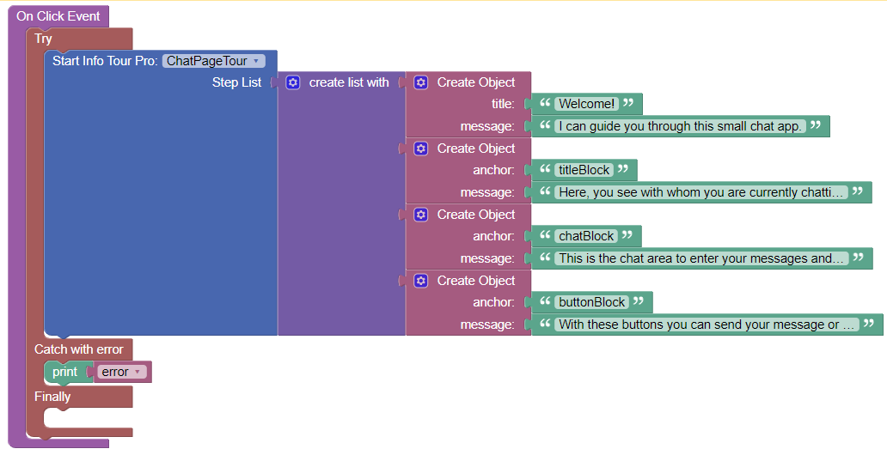
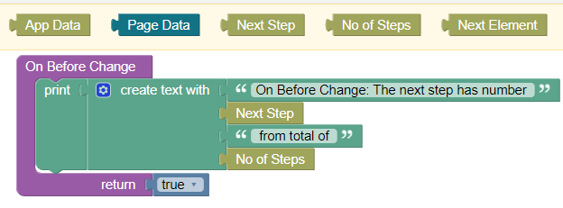

# Endless Info Tour

This is the documentation for the UI components ***Endless Info Tour*** and ***Endless Info Tour Pro*** for the [Backendless Full Stack Visual App Development Platform](https://backendless.com).

<center>

 &nbsp; &nbsp; &nbsp; &nbsp;


</center>

<br>

## Use Cases
User onboarding for your app. Provide guidance for UI elements on your page in a step-by-step, interactive tour, showing tooltips for each relevant screen area. Start the below video to see a demo:


https://user-images.githubusercontent.com/69795385/188916715-0b5e0aa4-6fe7-405e-a578-618a7fd7f86a.mp4

<br>

## General usage
- Place the component somewhere on a page. There will be no immediate visible reflection in the published preview or in the published app. Don't worry.
- Fill the ``Id`` property of the component in the side panel. Otherwise, you will not be able to work with tour actions
- To trigger a tour, use the Action ``Start``, for instance, within an On-Click-Handler of a button:



The Action ``Start`` receives the parameter ``Step List`` which must be a list of objects. Each object represents one step of the tour. Each object in the list can contain the following properties:
- ``title`` (optional): The title of the tooltip for a step. Can contain HTML-tags.
- ``anchor`` (optional): The ``Id`` of the HTML-element to which the tooltip shall relate to. Currently, in Backendless UI-Builder, anchors can be assigned to Block-UI-Elements only. Therefore, if you want to show a tooltip for a single UI-element or a group of UI-elements, you have to wrap them by a block and assign an anchor to this block. If you don't pass the ``anchor``-parameter to the ``Start``-action, the tooltip will be centered on the page without any relation to a UI-element.
- ``message``: The information you want to convey by the tooltip. Can contain HTML, for instance, ```` or hyperlink ``<a>``-tags, or any HTML-formatting.

<br>

## Actions
For each Codeless Block of an action, you have to select the ``Id`` of the custom component instance, which you placed on the page.

### Start
This action is exposed via a Backendless Codeless Block. See section [General usage](#general-usage) for an example. The block parameter has to be set to the ``Id`` of a info tour component instance on the page.

<br>

## Properties

### Next Step Label
**(Pro-version only)** The text label on the button which triggers the next step of a tour. Can contain HTML-tags. This label can be set by a logic handler or by data binding. For the non-Pro-version the label is set to "Next".

### Previous Step Label
**(Pro-version only)** The text label on the button which returns to the previous step of a tour. Can contain HTML-tags. This label can be set by a logic handler or by data binding. For the non-Pro-version the label is set to "Back".

### Done Label
**(Pro-version only)** The text label on the "Done"-button which is shown for the last step of a tour. Can contain HTML-tags. This label can be set by a logic handler or by data binding. For the non-Pro-version the label is set to "Done".

### Show Step Numbers
If checked, the number of the current step is shown in tooltips together with the total number of steps (e.g. "2 of 5").

### Step Number Separator
**(Pro-version only)** The word "of" seperating step numbers by default can be changed to support any language. This word can be set by a logic handler or by data binding.

### Show Progress Bullets
If checked, the tour progress is indicated by a set of clickable bullets.

### Show Progress Bar
If checked, the tour progress is indicated by a progress bar.

### Keyboard Navigation
**(Pro-version only)** If checked, the tour can be stepped through with a keyboard. The arrow-keys, the enter-key, the tab-key and the shift-tab-key can be used.

### Exit On Esc
**(Pro-version only)** If checked, the Escape-key (Esc) can be used to exit from the tour at any time.

### Exit on Background Click
**(Pro-version only)** If checked, the tour can be exited by clicking outside of the tooltip.

### Don't Show Again
**(Pro-version only)** If checked, each tooltip offers the option to not start the tour the next time, even if the ``Start``-action is called. *Info Tour Pro* stores a cookie in the browser, by which it recognizes that the next ``Start``-action shall be ignored. To re-activate the tour, the cookie must be deleted, or its lifetime must be expired.

### Don't Show Again Label
**(Pro-version only)** The label used in the tooltip when offering the option "Don't Show Again". This label can be set by a logic handler or by data binding.

### Don't Show Again Cookie
**(Pro-version only)** The name of the cookie which is created when the "Don't Show Again"-option is selected. The default value is ``tour-dontShowAgain``.

### Cookie Lifetime
**(Pro-version only)** The cookie lifetime in days. The default is ``365``.

<br>

## Events

### On Before Change
(**Pro-version only**)

Each time a new step is going to become active, this event handler is called. The context blocks ``Next Step``, ``No of Steps`` and ``Next Element`` are available.



``Next Element`` is a reference to the DOM-element which has been linked to the next tour step.

The handler returns a boolean value. Returning ``true`` causes the next step to become active. Returning ``false`` prevents from setting the next step active. In this case, the current step is kept active.

### On Before Exit
(**Pro-version only**)

This event handler is called before a user leaves a tour either by pressing the exit button, clicking in the background overlay, or finishing the tour in the regular way. The context blocks ``Current Step`` and ``No of Steps`` are available.

The handler returns a boolean value. Returning ``true`` causes the tour to exit. Returning ``false`` prevents the tour from exiting. In this case, the current step is kept active.

### On Complete
(**Pro-version only**)

This event handler is called when the tour is going to be completed. The context block ``Final Step`` is available.

Note: when completing a tour, the event ``On Complete`` is called before the event ``On Before Exit``.

<br>

## Styles
(**Pro-version only**)
Create a theme extension in Backendless UI Builder to change any of the following less-variables (default values are shown):

```css
@el-tour-backgroundColor: @appBackgroundColor;

@el-tour-text-color:      contrast(@el-tour-backgroundColor);
@el-tour-text-fontSize:   1em;
@el-tour-text-fontWeight: inherit;
@el-tour-text-fontStyle:  normal;
@el-tour-text-textAlign:  left;
@el-tour-text-padding:    1.2em;
@el-tour-text-margin:     0;

@el-tour-title-color: @el-tour-text-color;
@el-tour-title-fontSize:   calc( @el-tour-text-fontSize * 1.2 );
@el-tour-title-fontWeight: 600;
@el-tour-title-fontStyle:  normal;
@el-tour-title-textAlign:  left;
@el-tour-title-padding:    0;
@el-tour-title-margin:     0;

@el-tour-skipButton-fontSize:   calc( @el-tour-text-fontSize * 1.5 );
@el-tour-skipButton-fontWeight: 600;
@el-tour-skipButton-color: lighten( @el-tour-text-color, 30% );

@el-tour-dontShowAgain-padding: 0 1.5em;
@el-tour-dontShowAgain-fontSize: calc( @el-tour-text-fontSize * 0.9 );
@el-tour-dontShowAgain-color: lighten( @el-tour-text-color, 20% );
@el-tour-dontShowAgain-checkboxSize: 0.85em;

@el-tour-bulletsColor:  #ccc;
@el-tour-bulletsWidth:  6px;
@el-tour-bulletsHeight: 6px;
@el-tour-bulletsColorActive:  #999;
@el-tour-bulletsWidthActive:  16px;
@el-tour-bulletsHeightActive: 6px;

@el-tour-progressBar-background: #e0e0e0;
@el-tour-progressBar-color: #08c;

@el-tour-stepNumbers-fontSize: calc( @el-tour-text-fontSize * 0.9 );
@el-tour-stepNumbers-color: lighten( @el-tour-text-color, 20% );
@el-tour-stepNumbers-padding: calc( @el-tour-text-fontSize * 0.7 );

@el-tour-button-backgroundColor: #f4f4f4;
@el-tour-button-color: @el-tour-text-color;
@el-tour-button-padding: 0.5rem 1rem;
```

<br>

## Restrictions
- The ``Display`` and ``Classes`` property of a component instance are not evaluated.
- Not guaranteed to work in Microsoft Internet Explorer

## Support
If you experience issues, you can [open an issue](https://github.com/klako-web/Endless-Components/issues/new) and assign the label ``tour``, or ``tourPro``. No support guarantee is provided for the free (non-Pro) version!
