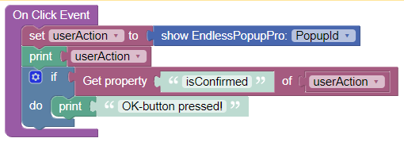

# KK-Popup

This is the documentation for ``KK-Popup`` and ``KK-PopupPro``.

## Use Cases
Create popups and toasts.

>**Disclaimer**: This component is not released for productive use yet. No warranties!

## General usage
- Place the component somewhere on a page. There will be no visible reflection in the preview. Don't worry.
- Fill the ``Id`` property in the side panel. Otherwise, you will not be able to work with actions
- To trigger a popup, use the component action ``show``. For instance, you can call this action within an ``On Click Event`` of a button.

- This action returns an object which basically shows which buttons have been pressed, for instance ``{"isConfirmed":true,"isDenied":false,"isDismissed":false,"value":true}``

<br>

## Actions
For each nocode-block of an action, you have to select the ``Id`` of the custom component instance, which you placed on the page.

### Show
This action is exposed via a Backendless Codeless Block. See **General usage** for an example. The block parameter has to be set to the ``Id`` of a component instance on a specific page.

<br>

## Properties

### Title
The text to be shown as popup title. The **Pro-version** supports HTML.

### Content
The text to be shown as popup content. The **Pro-version** supports HTML.

### Footer
(**Pro-version only**) The text to be shown as popup footer. Supports HTML.

### Icon Type
The type of the icon show with the popup

Possible values: ``<nothing>``, ``Information``, ``Warning``, ``Error``, ``Success``, ``Question``.

### Show Confirm Button
Boolean to decide whether to show the confirm button. Defaults to ``true``.

### Confirm Button Text
Defaults to "OK".

### Show Deny Button
Defaults to ``false``

### Deny Button Text

### Show Cancel Button
Defaults to ``false``

### Cancel Button Text

### Show Close Button
Defaults to ``false``

### Show as Toast
Defaults to ``false``

A "Toast" is a little message box which shows information for a limited amount of time. Use the ``Duration``-property to control how long the toast is shown.

### Duration
(**Pro-version only**) Controls how long a popup or toast is shown in milliseconds. For the **non-Pro-version**, this interval is fixed at 2000 ms.

### Position
(**Pro-version only**) Postion of the popup on the screen. Can be ``Top``, ``Top Left``, ``Top Right``, ``Center``, ``Center Left``, ``Center Right``, ``Bottom``, ``Bottom Left``, ``Bottom Right``. For the **non-Pro-version**, the position is always ``Center``.

### Width
Popup window width, including paddings (box-sizing: border-box). Can be in any CSS unit (e.g, ``px``, ``em``, ``rem``, ``%``). Defaults to ``32em``.

### Color
Color for title, content and footer.

### Background
Popup window background color.

### Image
(**Pro-version only**) An image to be shown in the popup.

### Image Width
(**Pro-version only**) Custom image width. Can be in any CSS unit (e.g., ``px``, ``em``, ``rem``, ``%``).

### Allow Outside Click
(** Pro-version only**) Defaults to ``true``. If this is set, the popup can be closed by clicking into the background outside of the popup. For the **non-Pro-version**, the value is always ``true``.

## Styling
(**Pro-version only**)

Styling works by defining a class ``swal2Popup`` in your theme editor. Here is an example with some commonly used styling elements:
```
.swal2Popup {
  .swal2-title {
    color: red;
    background: blue;
    font-size: 22px;
    padding-bottom: 12px;
  }
  .swal2-icon.swal2-warning {
    background-color: #3fc3ee;
    border-color: #018786;
    color: #b00020;
  }
  .swal2-image {
    margin: 2em auto 1em;
  }
  .swal2-html-container {  // the popup/toast content
    text-align: left !important;
    font-size: 2em !important;
  }
  .swal2-actions {   // the button box
    flex-wrap: wrap;
    align-items: center;
    .swal2-deny {
      border-color: black;
      border-style: solid;
      border-width: 3px;
    }
  }
  .swal2-footer {
    color: yellow;
    background: grey;
  }
}
```
Styling affects all instances of this custom component in your application.

<br>
<br>

## Reused libraries and components
This product includes the following external code libraries/components, which are not owned by the author of ``KK-Popup``, or ``KK-PopupPro``:

- [Sweetalert2](https://sweetalert2.github.io/). Licensed under the [MIT License](https://github.com/sweetalert2/sweetalert2/blob/main/LICENSE).