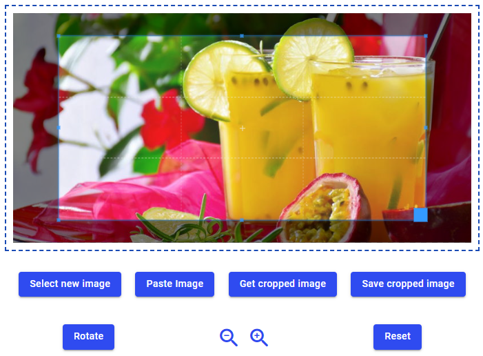

# KK-ResizedCroppedImageUploader

## Use Cases
- Select an image from local file system, camera, or clipboard
- Rotate the image
- Crop an area of interest
- Save the image to Backendless file system with reduced size (width, height) and reduced quality (for lossy image formats) and desired image type.

 

> ---
>**Disclaimer**: This component is not released for productive use yet. No warranties!
> ---

 

## General usage
1. Place a Block-UI-component on a page where you want to display the preview of an image to be uploaded. Adjust the dimensions and other properties of this Block-component to your needs.
2. Place the custom component ``KK_ResizedCroppedImageUploader`` into the Block-component. 
3. Fill the ``Id`` property of the custom component in the side panel. Otherwise, you will not be able to work with actions.
4. Place buttons on your page. In the respective "On Click Event"-handlers call one of the custom component actions. An example how this can look like is shown here:

By default, a resizable crop box is shown after an image has been selected.

 
 

## Properties

### No Crop Box
Boolean. If checked, no resizable crop area is shown above the image. Still, parts of the image can be cropped, by zooming-in and moving the image along the canvas. The save and crop action will then crop the visible part of the image.

### Min Canvas Width
By default, the canvas size is set to the size of loaded image, of course within the constraints set by the surrounding Block-UI-component. If you deal with very small image, it can make sense to set a minimal canvas size in pixel. It is recommended to then either set ``Min Canvas Width`` or ``Min Canvas Height``. The property which is not set will be computed to match the image width-to-height ratio.

### Min Canvas Height
See ``Min Canvas Width``.

 

## Actions
For each nocode-block of an action, you have to select the ``Id`` of the custom component instance, which you placed on the page.

### Select Image
*Input parameters:* None

An image selection dialog is shown, which depends on the device. On mobiles, you can typically capture a live camera image in addition to selecting an existing image from the device.

*Example*:

### Paste Image
*Input parameters:* None

An image is inserted from the device clipboard. If this is done for the first time, the device will ask for permissions for this operation. If you do not grant permission, the paste operation will fail. 

> **Note:** The paste action does not work on all browsers (yet). For instance, Firefox is not supporting the required permission. Therefore, if you want to leverage this action, test with the browser versions relevant for you.

### Rotate Image
*Input parameters:* 
- ``Degree``: The amount of rotation degrees. Can be a positive or negative number.

*Example*:

### Zoom In/Out
*Input parameters:* 
- ``Ratio``: The ratio of (de-)magnification . Can be a positive or negative number.

> Note: Zooming-in/out is  just a visual effect. The actual image file size and content is not changed.

*Example*:

### Save Cropped Image
Uploads the crop area of the image to the Backendless file system. An image can be scaled along its width or height dimension and the image encoding type can be chosen (jpeg, webp, png, etc.). For image types supporting lossy compression (e.g. jpeg, webp) the amount of compression can be specified.

*Input parameters:*
- ``No Scaling``: Optional. Default is ``false``. If set to ``true`` images are not scaled when extracted or saved from the canvas. In this case, the parameters ``Scaling Dimension`` and ``Pixel Size`` are ignored.
- ``File Name``: Optional. The name of the file to be saved (including file extension). If omitted, the name of the selected file is used, where the file extension is set according to the input parameter ``Image Type``. If an image is pasted from the clipboard and ``File Name`` is omitted, a name "fromClipboard``wxyz``.png" is generated, where ``wxyz`` is a random 4-digit number.
- ``File Path``: Mandatory. The target path on the Backendless file system, for example ``/web/tmp/``. The current user must have the appropriate permissions to create and write files.
- ``Scaling Dimension``: Optional. Valid values are ``width`` and ``height``. Before uploading the image to the Backendless file system, it can be scaled along either its width or height dimension.
- ``Pixel Size``: Optional. The amount of pixels to be set for the selected scaling dimension. The number of pixels for the other dimension is computed in a way that does not change the image aspect ratio.
- ``Compression Ratio``: Optional. A number between ``0`` and ``1``. The default is ``0.8``. Is applied if the resulting image type supports lossy compression (e.g., ``jpg``, ``webp``).
- ``Image Type``: Optional. The image encoding type (``jpg``, ``png``, etc.) of images extracted from the canvas. If omitted, the type is taken from the specified filename.

### Get Cropped Image
t.b.d.

### Reset
t.b.d.

 
 

## Styling

 
 

## Reused libraries and components
This product includes the following external code libraries/components, which are not owned by the author of ``KK_ResizedCroppedImageUploader``:

- [Cropper.js](https://fengyuanchen.github.io/cropperjs/). Licensed under the [MIT License](https://github.com/fengyuanchen/cropperjs/blob/main/LICENSE).