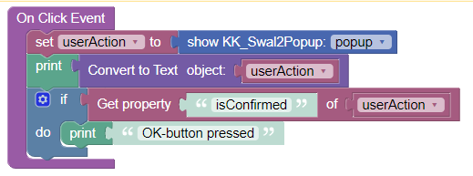

# KK_Swal2Popup

To create popups and toasts. A wrapper of the popular library [sweetalert2](https://sweetalert2.github.io/).

>**Disclaimer**: This component is not released for productive use. No warranties!

## General usage
- Place the component somewhere on a page. There will be no visible reflection in the preview. Don't worry.
- Fill the ``Id`` property in the side panel. Otherwise, you will not be able to work with actions
- To trigger a popup, use the component action ``show``. For instance, you can call this action within an ``On Click Event`` of a button.

- This action returns an object which basically shows which buttons have been pressed, for instance ``{"isConfirmed":true,"isDenied":false,"isDismissed":false,"value":true}``

## Properties

### Title
The text to be shown as popup title. Can be HTML.

### Content
The text to be shown as popup content. Can be HTML.

### Footer
The text to be shown as popup footer. Can be HTML.

### Icon Type
The type of the icon show with the popup

Possible values: ``<none>``, ``Information``, ``Warning``, ``Error``, ``Success``, ``Question``.

### Show Confirm Button
Boolean to decide whether to show the confirm button. Defaults to ``true``.

### Confirm Button Text
Defaults to "OK".

### Show Deny Button
Defaults to ``false``

### Deny Button Text

### Show Cancel Button
Defaults to ``false``

### Cancel Button Text

### Show Close Button
Defaults to ``false``

### Show as Toast
Defaults to ``false``

A "Toast" is a little message box which shows information for a limited amount of time. Use the ``Duration``-property to control how long the toast is shown.

### Duration
Controls how long a popup or toast is shown.

### Position
Postion of the popup on the screen. Can be ``Top``, ``Top Left``, ``Top Right``, ``Center``, ``Center Left``, ``Center Right``, ``Bottom``, ``Bottom Left``, ``Bottom Right``.

### Width
Popup window width, including paddings (box-sizing: border-box). Can be in any CSS unit (e.g, ``px``, ``em``, ``rem``, ``%``). Defaults to ``32em``.

### Color
Color for title, content and footer.

### Background
Popup window background color

### Image
An image to be shown in the popup

### Image Width
Custom image width. Can be in any CSS unit (e.g., ``px``, ``em``, ``rem``, ``%``).

### Allow Outside Click
Defaults to ``true``. If this is set, the popup can be closed by clicking into the background outside of the popup.

## Styling

