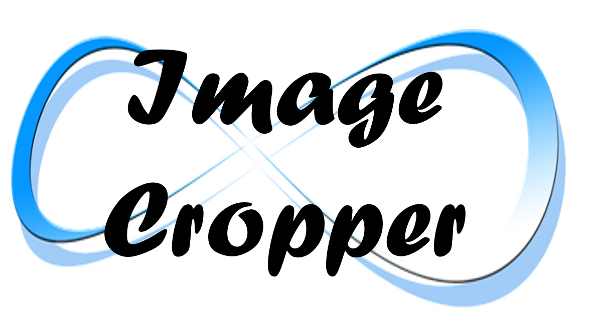

# Endless Backendless Components

### Documentation for *Endless UI Components* for the [Backendless Full Stack Visual App Development Platform](https://backendless.com).

 

 

| | |
| --- | --- |
|  | Create popups, toasts and alerts. Toasts are lightweight notifications windows which are displayed for a certain amount of time. |
|  |  User onboarding for your app. Provide guidance for UI elements on your page in a step-by-step, interactive tour showing tooltips for each relevant screen area.  |
|  |  Crop, resize, compress, rotate and zoom images from your device or device camera. Save the result to the Backendless file system.  |
|  |  Upload, download, view and organize files on the Backendless file system. Work with the well-known file explorer user experience including Drag & Drop support on desktop and tablets. |

