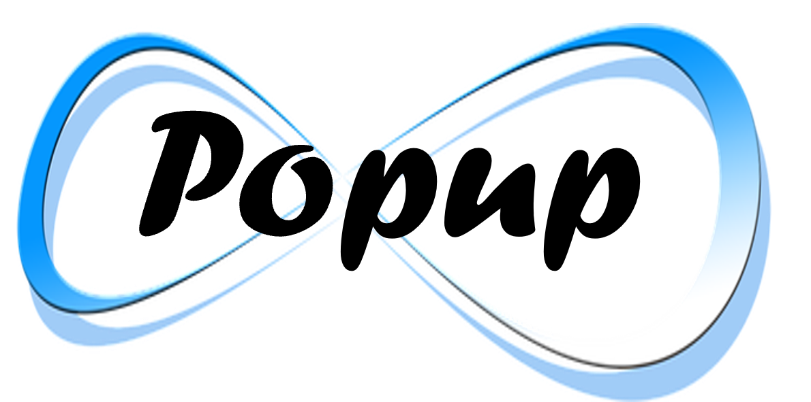

# Endless Components

### UI Components for the [Backendless Full Stack Visual App Development Platform](https://backendless.com).

 

  

Components are usually offered as two variants. A free version and a Pro-version with an associated fee. No support is offered for the free versions, but you are welcome to create [discussions](https://github.com/klako-web/Endless-Components/discussions) and [issues](https://github.com/klako-web/Endless-Components/issues).

 

| | |
| --- | --- |
| 
  | [Create popups, toasts and alerts.](./EndlessPopup/README.md) Toasts are lightweight notifications windows which are displayed for a certain amount of time. |
| 
  | [User onboarding for your app.](./EndlessTour/README.md) Provide guidance for UI elements on your page in a step-by-step, interactive tour showing tooltips for each relevant screen area.  |
| 
  | [Crop, resize, compress, rotate and zoom images from your device or device camera](./EndlessImageCropper/README.md). Save the result to the Backendless file system.  |
| 
  | [Upload, download, view and organize files on the Backendless file system.](./EndlessFileManager/README.md) Work with the well-known file explorer user experience on desktops and tablets. Including Drag & Drop support on desktop. |

